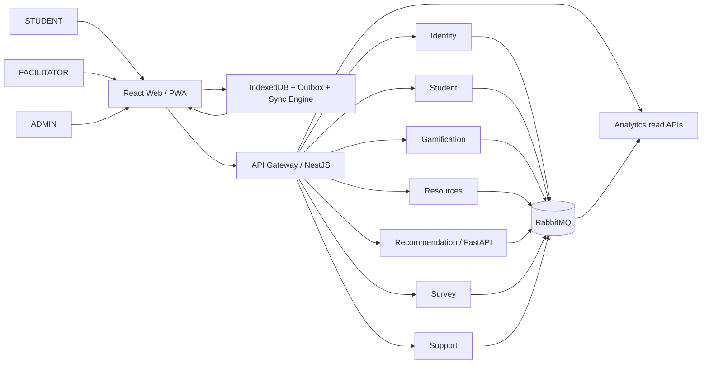
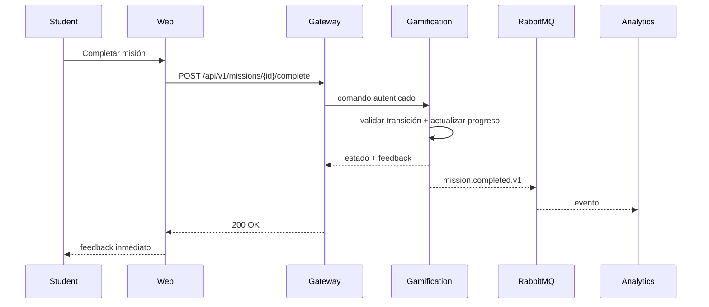
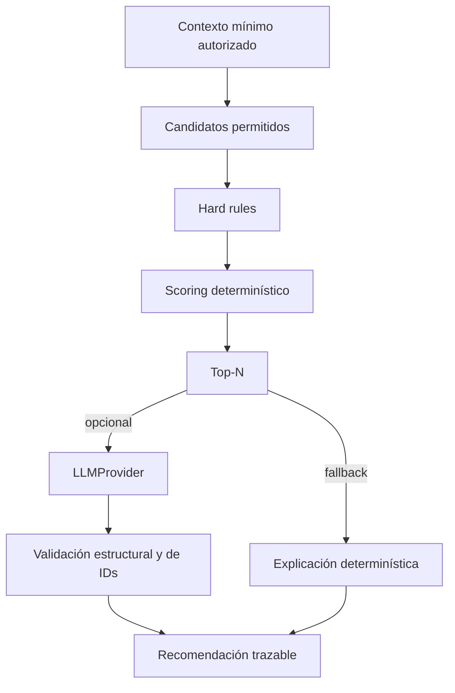
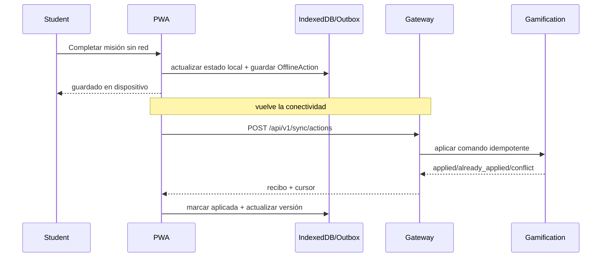

# Arquitectura del sistema

## 1. Estilo

La V1 adopta microservicios por dominio. El objetivo no es “tener muchos servicios”, sino separar responsabilidades que cambian por razones distintas: identidad, contexto del estudiante, ludificación, recursos, recomendaciones, encuestas, acompañamiento y analítica.

## 2. Contexto

## 2.1 Capa PWA local-first

`apps/web` se diseña para incorporar IndexedDB, outbox y Sync Engine. No existe un microservicio PWA. Para STUDENT la UI puede operar contra estado local y sincronizar después; FACILITATOR es lectura cacheada limitada; ADMIN requiere conexión para mutaciones. Ver `pwa-offline-sync.md` y ADR-005.

## 3. Comunicación

### HTTP/REST
Se usa cuando el usuario necesita respuesta inmediata: login, perfil, misión, recomendación, encuesta o una operación administrativa confirmable.

### Sincronización PWA
El gateway expone `sync/bootstrap`, `sync/pull` y `sync/actions`. Cada acción lleva `clientEventId`, versión base y timestamp de cliente. El gateway coordina; el microservicio dueño valida y aplica.

### RabbitMQ
Se usa para propagación desacoplada de hechos de dominio y analítica. Los productores no dependen de que analytics esté disponible para terminar la operación principal.

## 4. Datos

Cada servicio posee su persistencia lógica. V1 puede compartir un único servidor PostgreSQL por economía operativa, pero cada servicio tiene esquema/base, credenciales y migraciones propias. No se permiten joins directos entre servicios.

## 5. Flujo principal de misión

## 6. Flujo del recomendador

## 6.1 Flujo offline de misión

## 7. Disponibilidad y fallos

- Caída del LLM: el recomendador usa fallback determinístico.
- Caída de analytics: productores continúan; RabbitMQ conserva/reintenta según política.
- Mensaje duplicado: consumidores usan `eventId` para idempotencia.
- Servicio remoto lento: timeouts explícitos, circuit breaker donde aplique y error estable hacia el gateway.
- Sin conectividad: STUDENT continúa con datos sincronizados; acciones aptas van a outbox.
- Reintento de outbox: `clientEventId` impide duplicados.
- Conflicto: se aplica política por dominio; no se sobrescribe silenciosamente.
- Base de un servicio indisponible: el fallo se contiene en ese dominio; no hay acceso directo alternativo a otra base.

## 8. Atributos de calidad prioritarios

- **Mantenibilidad:** límites de dominio, contratos versionados y ADRs.
- **Seguridad:** RBAC, asignación, minimización y auditoría.
- **Disponibilidad funcional:** funciones esenciales no dependen del LLM.
- **Trazabilidad:** eventos, versiones de reglas y correlation ID.
- **Usabilidad:** baja presión, autonomía y recuperación sin castigo.
- **Compatibilidad futura:** REST/OpenAPI, eventos versionados y posibilidad de SSO posterior.
- **Resiliencia de cliente:** operación offline, idempotencia, versionado local y recuperación de sincronización.

## 9. Alcance de despliegue

V1 se ejecuta localmente con Docker Compose. No se requiere Kubernetes, service mesh ni alta disponibilidad institucional. La separación en servicios prepara una evolución futura, pero no convierte el piloto en un sistema de producción masivo.

## 10. Fuentes de diseño

El marco arquitectónico suministrado separa interfaz, servicios, motor de ludificación, pipeline de IA, broker de eventos y persistencia, y plantea asincronía para desacoplar operaciones costosas. La tesis acota el producto a un prototipo funcional con perfil, misiones, progreso, recuperación, recomendaciones, microcuestionarios y registro de eventos.
