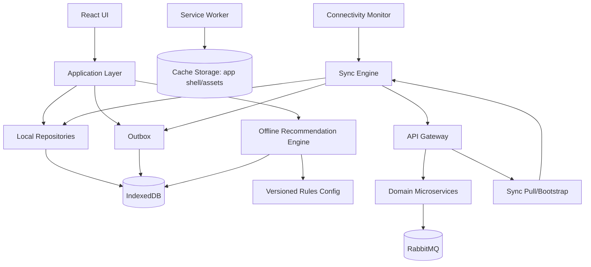

# Arquitectura PWA local-first y sincronización offline

**Estado:** decisión aprobada  
**Alcance:** V1 preparada para evolucionar a PWA; operación offline completa para STUDENT; lectura cacheada limitada para FACILITATOR; operaciones ADMIN solo online.

## 1. Objetivo

La aplicación web debe poder evolucionar a una **Progressive Web App local-first** sin rediseñar los dominios. El objetivo funcional es que un estudiante previamente autenticado pueda continuar su flujo principal sin conexión y sincronizar acciones de forma segura e idempotente cuando la conectividad regrese.

La PWA no convierte el navegador en una copia de los microservicios. El servidor continúa siendo la autoridad sobre identidad, permisos, catálogos publicados, reglas versionadas y persistencia definitiva. El cliente mantiene una réplica mínima y temporal de los datos necesarios para la experiencia offline.

## 2. Capacidades por rol

| Capacidad | STUDENT | FACILITATOR | ADMIN |
|---|---|---|---|
| Abrir app instalada sin red | Sí | Sí, si existe cache válida | Sí, solo shell informativo |
| Ver datos previamente sincronizados | Sí | Sí, lectura limitada | No se promete operación funcional offline |
| Completar/posponer/descartar misiones | Sí | - | - |
| Actualizar campos permitidos del perfil | Sí, con outbox | - | No |
| Activar modo recuperación | Sí | - | - |
| Responder microcuestionarios | Sí, con outbox | - | No |
| Consultar recursos cacheados | Sí | Sí | No requerido |
| Generar recomendación nueva offline | Sí, rules + score local | - | - |
| Crear notas/compromisos | - | No offline | - |
| Administrar usuarios/reglas/catálogos | - | - | Online obligatorio |

## 3. Principios

1. **Local-first para STUDENT:** la UI responde primero contra estado local y sincroniza después cuando la operación es apta para offline.
2. **Servidor como autoridad:** permisos, catálogo vigente, reglas de negocio globales y datos consolidados se validan al sincronizar.
3. **Outbox explícita:** ninguna acción offline se pierde ni se considera sincronizada hasta recibir confirmación del servidor.
4. **Idempotencia end-to-end:** todo comando sincronizable incluye un identificador estable generado en cliente.
5. **Conflictos explícitos:** no se usa `last-write-wins` global.
6. **IA degradable:** sin red se usa rules + scoring determinístico; el LLM nunca es requisito para operación offline.
7. **Minimización local:** IndexedDB contiene únicamente datos necesarios para uso offline y se limpia según logout, retiro y política de retención.
8. **No Cache Storage para datos sensibles:** Cache Storage se reserva para app shell/activos y respuestas públicas seguras; datos de dominio autenticados viven en IndexedDB bajo una capa controlada.
9. **Trazabilidad:** se registra si una acción/recomendación nació online u offline y con qué versión de reglas/catálogo.

## 4. Componentes del frontend



### 4.1 `Service Worker`

La integración recomendada y documentada para Vite es `vite-plugin-pwa`. Cambiarla requiere justificar el impacto en estrategia de actualización/cache.

Responsable de:
- app shell;
- assets versionados;
- navegación offline hacia el shell;
- estrategia de actualización de assets;
- aviso de nueva versión disponible.

No debe implementar reglas de negocio ni almacenar indiscriminadamente respuestas autenticadas.

### 4.2 `IndexedDB`

Persistencia local de dominio para STUDENT. La implementación debe quedar detrás de repositorios/interfaces y usa `idb` como wrapper ligero de IndexedDB. Cambiar el wrapper requiere justificarlo en ADR si afecta contratos, migraciones o arquitectura.

Stores conceptuales:

```text
meta
student-profile-cache
mission-catalog-cache
mission-assignment-cache
progress-cache
resource-cache
survey-cache
recommendation-cache
recommendation-config-cache
outbox
sync-conflicts
```

### 4.3 `Outbox`

Cada acción pendiente contiene al menos:

```ts
interface OfflineAction {
  clientEventId: string;
  actionType: string;
  aggregateId: string;
  aggregateVersion?: number;
  clientOccurredAt: string;
  ruleVersion?: string;
  payload: unknown;
  status: 'pending' | 'syncing' | 'applied' | 'conflict' | 'rejected';
  retryCount: number;
}
```

`clientEventId` es UUID y permanece idéntico en todos los reintentos.

### 4.4 `Sync Engine`

Responsabilidades:
- detectar recuperación de conectividad;
- revalidar sesión antes de enviar cambios;
- enviar outbox en orden seguro;
- limitar concurrencia;
- aplicar backoff ante fallos transitorios;
- registrar recibos del servidor;
- descargar deltas/catálogos nuevos;
- detectar conflictos y exponerlos a la UI cuando se requiere decisión humana;
- actualizar `lastSuccessfulSyncAt`.

## 5. Contrato de sincronización

No se crea un microservicio nuevo de sincronización. El **API Gateway contiene un módulo de coordinación de sync** y delega cada acción al servicio dueño del dominio.

### 5.1 Bootstrap / pull

```http
GET /api/v1/sync/bootstrap
GET /api/v1/sync/pull?cursor=<opaque-cursor>
```

El bootstrap entrega el conjunto mínimo de datos autorizado para operación offline del usuario actual. `pull` devuelve cambios posteriores al cursor, no un dump indiscriminado.

Respuesta conceptual:

```json
{
  "serverTime": "2026-08-20T03:00:00Z",
  "cursor": "opaque",
  "catalogVersions": {
    "missions": 12,
    "resources": 8,
    "surveys": 4,
    "recommendationConfig": "1.0.0"
  },
  "student": {},
  "missions": [],
  "progress": {},
  "resources": [],
  "surveys": [],
  "recommendationConfig": {}
}
```

### 5.2 Push de acciones

```http
POST /api/v1/sync/actions
```

Request conceptual:

```json
{
  "actions": [
    {
      "clientEventId": "uuid",
      "actionType": "mission.complete",
      "aggregateId": "assignment-uuid",
      "aggregateVersion": 4,
      "clientOccurredAt": "2026-08-20T02:10:00Z",
      "payload": {}
    }
  ]
}
```

Response conceptual:

```json
{
  "results": [
    {
      "clientEventId": "uuid",
      "status": "applied",
      "serverVersion": 5,
      "serverOccurredAt": "2026-08-20T03:01:04Z"
    }
  ],
  "nextCursor": "opaque"
}
```

Estados posibles: `applied`, `already_applied`, `conflict`, `rejected`, `retryable_error`.

## 6. Política de conflictos

| Dominio | Política |
|---|---|
| Completar/aceptar/posponer misión | Comando idempotente. Se conserva la acción válida realizada offline sobre la versión de asignación sincronizada. Repetición retorna `already_applied`. |
| Misión despublicada mientras el estudiante estaba offline | Si la asignación ya había sido entregada al estudiante y el comando cumple sus reglas/versiones, se conserva la acción histórica; el servidor puede marcar la asignación como proveniente de catálogo antiguo para auditoría. |
| Perfil | Usar `baseVersion`. Si servidor y cliente modificaron el mismo campo desde esa versión, retornar conflicto; no sobrescribir silenciosamente. |
| Recursos | Servidor es autoridad. El recurso cacheado puede mostrarse offline con “actualizado por última vez”; al sincronizar se elimina/desactiva localmente si ya no es vigente. |
| Cuestionario | Se envía `surveyVersion` y `clientOccurredAt`. El servidor acepta solo si la versión/ventana permite una respuesta realizada en ese momento; de lo contrario retorna rechazo explicable. |
| Reglas/config del recomendador | Servidor es autoridad. El cliente usa únicamente una versión previamente firmada/validada como `lastKnownGood`; nunca inventa pesos. |
| Consentimiento retirado en otro dispositivo | En la siguiente conexión el servidor rechaza nuevas acciones que requieran consentimiento y ordena limpiar el cache correspondiente. |

## 7. Autenticación y uso offline

- El **primer login y la primera sincronización requieren conexión**.
- No se permite crear una sesión nueva estando offline.
- La PWA puede abrir datos cacheados para un STUDENT previamente validado solo dentro de una política de acceso offline acotada y configurable.
- La duración exacta del permiso offline debe definirse antes del piloto según riesgo y entorno de dispositivos; una IA no la decide unilateralmente.
- Al recuperar conexión, el servidor revalida estado de cuenta, roles y consentimiento antes de aceptar outbox.
- Logout borra secretos de sesión y datos locales que la política determine.
- Retiro de consentimiento sincronizado provoca limpieza/inutilización de caches asociados a personalización/estudio según política aprobada.
- No persistir bearer tokens en `localStorage`.

## 8. Recomendador offline

### 8.1 Decisión

Offline se ejecuta:

```text
hard rules + scoring determinístico + explicación determinística
```

No se ejecuta un LLM local. No se intenta simular al LLM.

### 8.2 Configuración compartida

El servidor publica una configuración versionada y validada:

```json
{
  "schemaVersion": 1,
  "ruleVersion": "1.0.0",
  "weights": {
    "needFit": 0.30,
    "timeFit": 0.20,
    "difficultyFit": 0.15,
    "continuityFit": 0.15,
    "resourceFit": 0.15,
    "diversityFit": 0.05
  }
}
```

Python y TypeScript interpretan el mismo contrato. El contrato, no una implementación concreta, es la fuente canónica de pesos/reglas configurables.

### 8.3 Paridad

Se mantiene una carpeta de fixtures compartidos con:
- contexto;
- catálogo mínimo;
- versión de reglas;
- ranking esperado;
- componentes de score esperados.

CI ejecuta los fixtures contra:
- motor Python del `recommendation-service`;
- motor TypeScript de la PWA.

Una diferencia fuera de tolerancia definida hace fallar CI.

### 8.4 Trazabilidad

Toda recomendación registra:

```text
recommendationId
source = OFFLINE_RULES | ONLINE_RULES | ONLINE_AI
ruleVersion
catalogVersion
candidateIds
selectedIds
scoreComponents
clientGeneratedAt
serverSyncedAt?
llmUsed
```

Una recomendación generada offline no se reescribe retrospectivamente cuando vuelve la red. Puede generarse una recomendación online nueva para el estado actual.

## 9. UX de conectividad

La UI debe mostrar estados comprensibles, no técnicos:
- `Sin conexión`;
- `Guardado en este dispositivo`;
- `Pendiente de sincronizar`;
- `Sincronizado`;
- `Hay un cambio que necesita tu revisión`;
- `Contenido actualizado por última vez ...`.

No bloquear una misión válida porque desapareció temporalmente la red.

Para STUDENT deben diseñarse en Figma:
- indicador de conectividad;
- estado de sync por acción;
- cola pendiente accesible pero no alarmista;
- conflicto de perfil;
- recomendación offline diferenciada de recomendación enriquecida con IA;
- actualización de app disponible;
- primera sincronización requerida.

## 10. Observabilidad y analítica

Métricas técnicas mínimas:
- tamaño de outbox;
- edad del item pendiente más antiguo;
- `sync_success_rate`;
- `sync_conflict_rate`;
- `sync_rejected_rate`;
- latencia de sync cuando vuelve la red;
- versión de cache/catálogo;
- recomendaciones `OFFLINE_RULES` vs `ONLINE_AI`.

Analytics recibe los eventos solo al sincronizar. Se conserva `clientOccurredAt` además de `serverOccurredAt` para no falsear la cronología longitudinal.

## 11. Pruebas obligatorias

1. instalar PWA y abrir shell sin conexión;
2. completar misión offline, recargar app y conservar estado local;
3. reconectar y sincronizar una sola vez pese a reintentos;
4. perder conexión durante sync y reanudar sin duplicar;
5. dos cambios concurrentes del mismo campo de perfil producen conflicto visible;
6. recurso desactivado en servidor deja de aparecer tras pull;
7. respuesta de survey offline conserva versión y hora de cliente;
8. motor Python y TypeScript producen ranking equivalente en fixtures compartidos;
9. recomendador offline no realiza ninguna llamada al LLM;
10. ADMIN no puede ejecutar mutaciones administrativas sin conexión;
11. FACILITATOR no puede crear notas offline;
12. logout/retirada ejecuta política de limpieza local.

## 12. Orden de implementación

La PWA se implementa por incrementos, no como una única tarea gigante:

1. shell instalable + manifest + estrategia de actualización;
2. IndexedDB y repositorios locales;
3. bootstrap/pull;
4. outbox y sync de misiones;
5. conflictos/versiones;
6. profile/surveys/recovery offline;
7. recursos cacheados;
8. recomendador TypeScript offline + parity tests;
9. UX de conectividad y hardening;
10. pruebas E2E con red intermitente/offline.

## 13. No objetivos

- LLM local en navegador.
- Operación administrativa offline.
- Sincronización peer-to-peer.
- Background sync como única garantía: se puede aprovechar si el navegador lo soporta, pero el motor debe funcionar también al abrir/reanudar la app.
- Cachear datos indefinidamente.
- Resolver conflictos sensibles de forma silenciosa.
