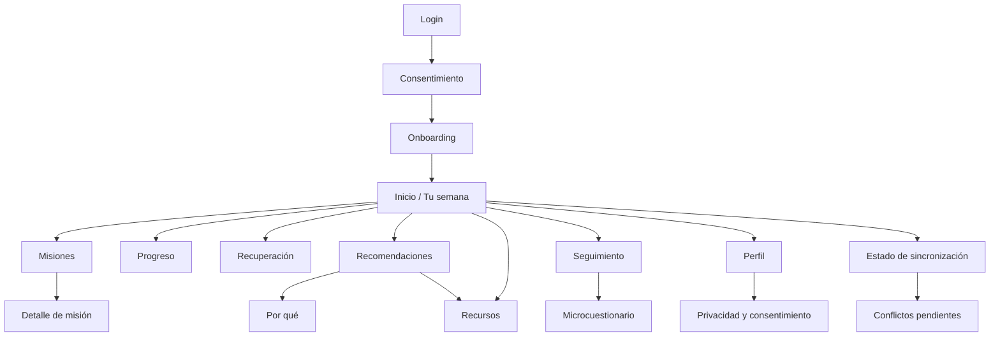
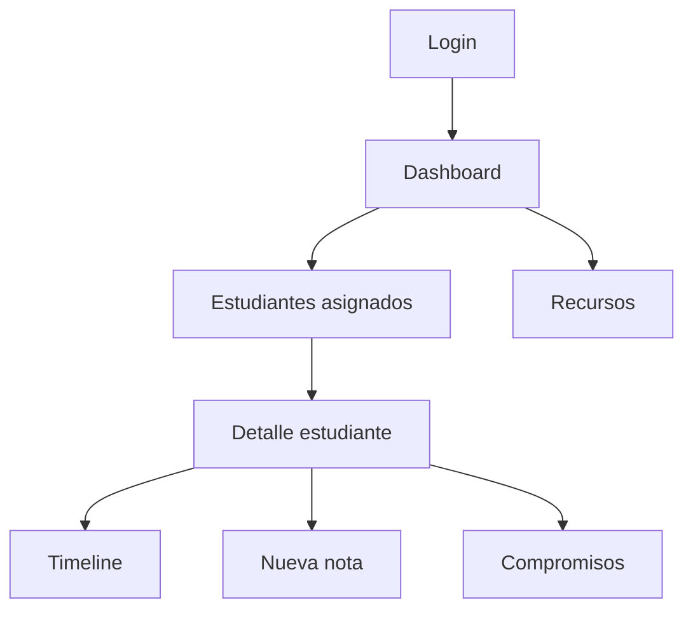
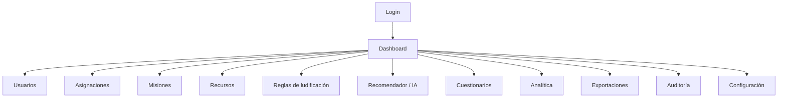

# Sitemap V1

## Student

## Facilitator

## Admin

## Navegación

- Student: navegación primaria corta; no más de 4-5 destinos principales visibles simultáneamente en mobile.
- Facilitator/Admin: sidebar desktop con permisos; ocultar y además bloquear rutas no permitidas.
- La URL nunca es mecanismo de autorización.

## PWA

Los estados `offline`, `pendiente`, `sincronizado` y `conflicto` son estados transversales y no requieren convertirse en destinos principales. La pantalla de estado de sincronización debe ser accesible desde Student sin aumentar la navegación primaria más allá de 4-5 destinos.
