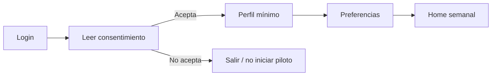
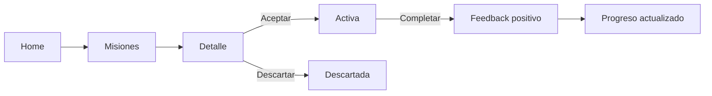
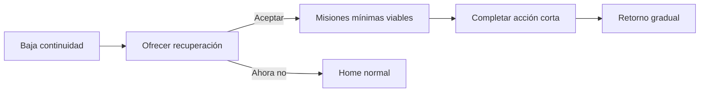
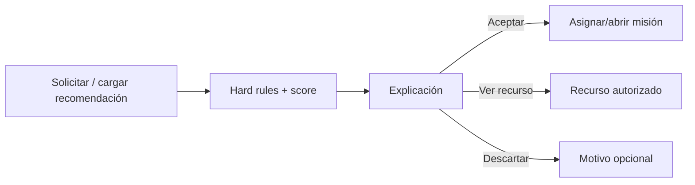
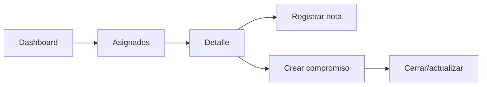
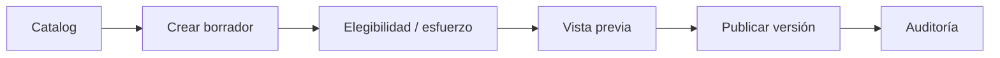
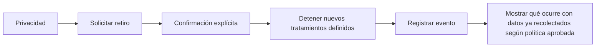
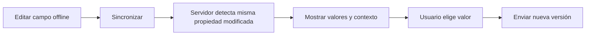
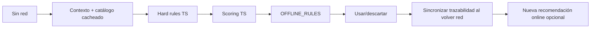

# User flows V1

## UF-01 Consentimiento y onboarding

**Reglas:** el estudiante puede omitir campos opcionales; se explica el propósito de datos usados para personalización.

## UF-02 Misión principal

## UF-03 Recuperación

**Copy:** no usar “fallaste”, “rompiste la racha” ni urgencia artificial.

## UF-04 Recomendación

## UF-05 Facilitator

## UF-06 Admin publica misión

## UF-07 Retiro de consentimiento

## UF-08 Misión offline y sincronización

```mermaid
flowchart LR
  Mission[Misión cacheada] --> Complete[Completar sin red]
  Complete --> Local[Guardar estado local]
  Local --> Outbox[Outbox pendiente]
  Outbox --> Reconnect[Vuelve conexión]
  Reconnect --> Validate[Revalidar sesión/consentimiento]
  Validate --> Push[Enviar clientEventId]
  Push --> Applied[Applied / already_applied]
  Applied --> Pull[Pull de estado nuevo]
  Pull --> Synced[Sincronizado]
```

## UF-09 Conflicto de perfil

## UF-10 Recomendación offline

